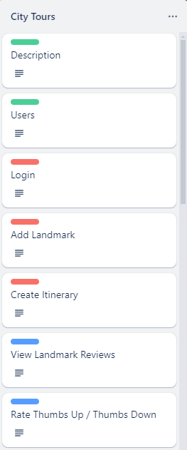
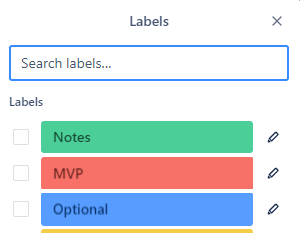
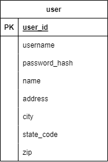

# Module Two final project

There are 3 options for the Module-2 final project:

1. Implement the provided Solar Systems Geek e-commerce application described below.
2. Create and implement your own application. 
3. Implement an application from a Trello board project [here](https://trello.com/b/SHSRQCza/te-module2-final-projects)

If a custom application was completed for the Module-2 mid-module project, that project can be extended and built upon for the Module-2 final project.

The provided Solar Systems Geek e-commerce application is guided with requirements describing exactly what work needs to be done.
However, since the application and the instructions were created by Tech Elevator it is a part of the
Tech Elevator curriculum and therefore can not be hosted publicly nor can it be used directly in your software portfolio.

## Design Requirements

All applications must be accompanied by project design documents, charts, and/or diagrams.
 * Required design documents must be submitted along with the source code in the `/design` folder at the root of this project.
 * Recommended design documents are optional.

### Required

* [**Custom project only**] Documentation of functional requirements to act as the application's Minimum Viable Product ([MVP](https://en.wikipedia.org/wiki/Minimum_viable_product)).
  * A functional requirement describes what the application can do or provide from a user's perspective.
  * Functional requirements can be encapsulated into a *[user story](https://en.wikipedia.org/wiki/User_story)*. For example,
    * "As an unauthenticated user, I can review a list of products for sale."
    * "As an authenticated user, I can clear my cart, removing all items from the cart."
    * See the Solar Systems Geek [Requirements](#requirements) section later in this document for more examples.
* Database ERD diagram
    * Table columns
    * Table relationships
    * Table constraints
* API endpoint design
    * Endpoints listing HTTP method and URL
    * Success and error status codes for endpoints
    * Any JSON request and/or response body schemas

Below is an example of API endpoint design table:

| Endpoint              | Method | Description                   | Success |  Error   | Authentication   |
|:----------------------|:------:|:------------------------------|:-------:|:--------:|:-----------------|
| /api/reservation      |  GET   | Get all reservations          |   200   |   400    | None             |
| /api/reservation      |  POST  | Create a new reservation      |   201   | 400, 422 | Required         | 
| /api/reservation/{id} |  GET   | Get a specific reservation    |   200   |   404    | Creator or ADMIN |
| /api/reservation/{id} |  PUT   | Update a specific reservation |   200   | 404, 409 | Creator or ADMIN |
| /api/reservation/{id} | DELETE | Delete a specific reservation |   204   |   404    | ADMIN            |

### Recommended

* Class summaries
  * Instance variables
  * public methods
  * Inheritance or interface relationships
  * Examples:
    * DAO interfaces with method descriptions
    * Model classes
      * DTO @valid checks
    * Service classes
* Flow charts or [Sequence diagrams](https://en.wikipedia.org/wiki/Sequence_diagram)
  * Summarize end-to-end HTTP request to HTTP response for API endpoints
* Database Integration Test Plan
  * Happy Path test cases
  * Corner cases
  * Success criteria
  * Mock users and/or mock test data

## Creating or Extending your own Application

If you decide to create your own application or extend upon your mid-module project, **please confirm your Application proposal with your instructor.**

### Custom Project Requirements

The following are the minimum requirements your application must include:

* Documentation of at least 5 functional requirements
  * The provided login and registration flow **can not** be used as one of the 5 functional requirements.
* The tech stack used in class, namely Spring Boot and Postgres to create a backend web service.
* A REST API with appropriate, authenticated endpoints.
* Postgres database access via DAO pattern.
* A SQL script to create tables and any mock data.
* Database integration testing.
* Highly recommended, but not required, the use at least one external API.
* A clear purpose, function, or utility.

## Creating an Application from a Trello Board Project

[Trello Board projects](https://trello.com/b/SHSRQCza/te-module2-final-projects) contain *[user story](https://en.wikipedia.org/wiki/User_story)* cards, which act as the project's functional requirements.
Each card in a Trello Board is color coded with a green, red, or blue label.
 * Green label - Information only, no work needs to be done.
 * Red label - A user story that is a part of the minimum requirements to complete the project. These user stories must all be implemented to achieve a Minimum Viable Product ([MVP](https://en.wikipedia.org/wiki/Minimum_viable_product)).
 * Blue or Orange label - A user story that is optional and should only be completed *after* completing all the MVP (red) user stories.

Below is an example from the City Tours project: 

 

### Trello Project Requirements

The following are the minimum requirements your application must include:

* Must use the tech stack used in class, namely Spring Boot and Postgres to create a backend web service.
* A REST API with appropriate, authenticated endpoints.
* Postgres database access via DAO pattern.
* A SQL script to create tables and any mock data.
* Database integration testing.
* Highly recommended, but not required, to use at least one external API.
* Complete all or at least 5 of the MVP (red) User Stories

## Solar Systems Geek REST API

In this project, you'll build a REST API to support an e-commerce shopping cart.

The [Requirements](#requirements) section later in this document describes the endpoints needed.

## Database setup

To run the application, you must first create the `m2_final_project` database. Then run the `database/m2_final_project.sql` script to create the user table with some test users.

> Note: The script creates two users for testing, `user` and `admin`, which both have the password: `password`.

## Starting code

Begin by opening the Module Two final project in IntelliJ and reviewing the starting code.

The project contains code to support user authentication. This code includes JavaDoc comments explaining the purpose of the classes and methods.

## Requirements

The requirements are for a database and RESTful web API only. There are no requirements for a user interface. Perform testing of the required endpoints by using Postman.

### Database Design

The database for Solar System Geeks e-commerce store needs to keep track of products and each user's shopping cart.

#### Products

Each Product has the following attributes:
* Product SKU
* name
* description
* price
* image_name

The following products need to be added:

| product\_sku |           name           |         description         | price  |     image\_name      |
|:-------:|:------------------------:|:---------------------------:|:------:|:--------------------:|
| MUG-023 |  Solar Geeks coffee mug  |  Start your day off right!  | $14.99 | Product-MUG-023.jpg  |
| YET-001 |    Solar Geeks Yeti      |   Keep cool all day long.   | $21.99 | Product-YET-001.jpg  |
| ART-256 |     Galactic poster      | Beautiful view of a galaxy' | $9.59  | Product-ART-256.jpg  |
| TOY-978 |        Toy rocket        |   To infinite imagination   | $39.99 | Product-TOY-978.jpg  |
| EAT-235 |   Astronaut ice cream    |      As cold as space       | $5.79  | Product-EAT-215.jpg  |
| HAT-928 | Solar Geeks baseball cap | Look stylish with our logo  | $16.89 | Product-HAT-908.jpg  |
| LIT-612 |  Intro to Astrophysics   |  Learn about astrophysics   | $7.99  | Product-LIT-612.jpg  |

#### Shopping Cart

Each authenticated user has a shopping cart that can hold many products.
Each product can appear in more than one shopping cart.
An authenticated user can only have a single shopping cart.

The shopping cart has the following attributes:
* The user associated with the shopping cart
* The product to purchase
* The product quantity to purchase

If an authenticated user has a product in their cart and then adds the same item to their cart again,
the shopping cart should only contain a single entry for that product with a quantity of 2.

The shopping cart should have a *primary key* for each entry into the shopping cart.
This key is used to differentiate items added to the same user's shopping cart at different times if, for instance, the cart were cleared.

### REST API 

There are three groupings of requirements:

- **Provided**: documents the provided features in the starter code
- **Required**: features required to complete the project
- **Bonus**: optional features to extend the project and further develop your skills

### Provided

Use cases:
1. As an unauthenticated user, I need to be able to register myself with a username, address information, and password.
1. As an unauthenticated user, I need to be able to log in using my registered username and password.

API endpoints:
1. POST `/register` (Provided Use Case 1)
1. POST `/login` (Provided Use Case 2)

### Required

Use cases:
1. As an unauthenticated user, I can review a list of products for sale.
1. As an unauthenticated user, I can search for a list of products by name or SKU.
1. As an unauthenticated user, I can view additional information about a specific product (product detail).
1. As an authenticated user, I can view my shopping cart and see the following details:
    * The list of products, quantities, and prices in my cart
    * The subtotal of all products in my cart
    * The tax amount (in U.S. dollars) charged for my state
        - Obtain the tax rate from an external API using the URL: https://teapi.netlify.app/api/statetax?state=[state-code].
        - The state code is part of the user address information.
        - The tax rate returned from the API is a percentage. Convert this to a decimal value to use in calculating the tax amount.
    * The cart total, which is the subtotal plus the amount of tax
1. As an authenticated user, I can add a product to my shopping cart.
    * If the product is already in my cart, increase the quantity appropriately.
    * The quantity added must be positive.
1. As an authenticated user, I can remove an item from my shopping cart. This action removes this product from the cart entirely, regardless of the quantity in the cart.
1. As an authenticated user, I can clear my cart, removing all items from the cart.

Create API endpoints to perform the following:
1. Get the list of products (Required Use Case 1)
1. Search for products by product name or SKU (Required Use Case 2)
1. Get a single product (Required Use Case 3)
1. Get the user's cart (Required Use Case 4)
1. Add an item to the user's cart (Required Use Case 5)
1. Remove a single item from the user's cart (Required Use Case 6)
1. Clear the user's cart (Required Use Case 7)

### Bonus (Optional)

An authenticated user can have zero or many wishlists. Each wishlist has the following properties:
* The user associated with the shopping cart
* The name of the wishlist

A wishlist can contain many products and a product can appear on many wishlists.

A wishlist item (product) is unique and can only appear once within a wishlist.

Use cases:
1. As an authenticated user, I can see a list of all my wishlists.
1. As an authenticated user, I can see a single wishlist, including a list of the items on the wishlist.
1. As an authenticated user, I can create and name a new wishlist.
1. As an authenticated user, I can delete an existing wishlist that I own.
1. As an authenticated user, I can add a product to a wishlist that I own. If the item is already on the wishlist, it's not added again, and no error occurs.
1. As an authenticated user, I can remove a product from a wishlist that I own. If the item isn't on the wishlist, nothing is deleted, and no error occurs.

API endpoints:
1. Get user wishlists (Bonus Use Case 1)
1. Get wishlist (Bonus Use Case 2)
1. Create a wishlist (Bonus Use Case 3)
1. Remove wishlist (Bonus Use Case 4)
1. Add the product to the wishlist (Bonus Use Case 5)
1. Remove the product from the wishlist (Bonus Use Case 6)
